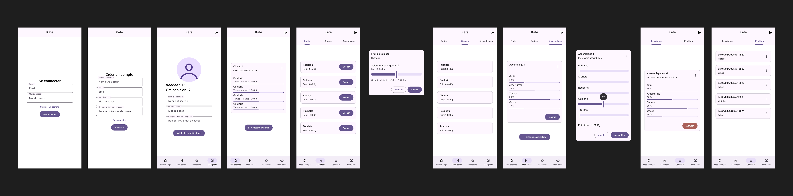
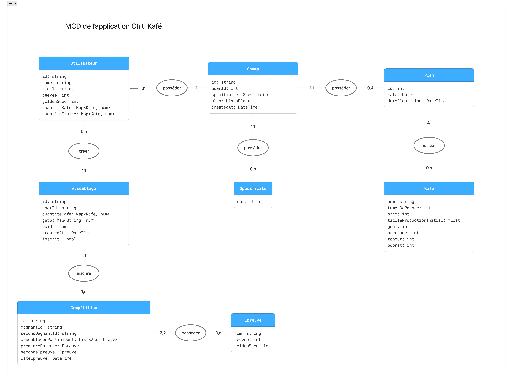

Application de l'éxamen mobile de fin d'année 2025 de [ForEach Academy](https://www.foreach-academy.fr/).

## Description

Jeu mobile réalisé en Flutter et utilisant Firebase mettant en scéne des exploiteurs de kafé et les faisant participer dans des concours de meilleurs grains de kafé.

___

## Énoncé de l'éxamen

[Énoncé](ressources/examen.pdf)
___

## Installer l'application

### Télécharger directement l'APK :

- Un apk est disponible dans l'archive d'évaluation.
- Télécharger l'APK depuis la dernière version disponible dans l'onglet "Release"
- [Devenez testeur pour l'application](https://appdistribution.firebase.dev/i/a8fb9f2dcfbce549)

### Compiler l'APK vous-même :

```bash
# Arrête le script en cas d'erreur
set -e

# Cloner le dépôt GitHub
echo ""
git clone "https://github.com/iDrack/kafe"
cd "kafe"

# Installer Flutter
if [ ! -d "$HOME/flutter" ]; then
  git clone https://github.com/flutter/flutter.git -b "3.29.2" "$HOME/flutter"
fi
export PATH="$HOME/flutter/bin:$PATH"

# Vérifier l'installation de Flutter
flutter --version

# Télécharger les dépendances du projet
flutter pub get

# Générer l'APK
flutter build apk --release
```

L'APK se trouvera dans build/app/outputs/flutter-apk/app-release.apk.

### Vous pouvez installer l'application sur un téléphone ou un émulateur Android.

___

## Conception

### Maquette de l'application :



### MCD de l'application :



### Script d'initialisation SQL:

<details>
  <summary>Voir le script</summary>

```sql
CREATE TABLE Utilisateur (
    id VARCHAR(255) PRIMARY KEY,
    name VARCHAR(255),
    email VARCHAR(255),
    deevee INT,
    goldenSeed INT
);

CREATE TABLE Kafe (
    nom VARCHAR(255) PRIMARY KEY,
    tempsDePousse INT,
    prix INT,
    tailleProductionInitiale FLOAT,
    gout INT,
    amertume INT,
    teneur INT,
    odeur INT
);

CREATE TABLE Plan (
    id INT PRIMARY KEY,
    kafe VARCHAR(255),
    datePlantation DATETIME,
    FOREIGN KEY (kafe) REFERENCES Kafe(nom)
);

CREATE TABLE! Specificite (
    nom VARCHAR(255) PRIMARY KEY
);

CREATE TABLE Champ (
    id VARCHAR(255) PRIMARY KEY,
    userId VARCHAR(255),
    specificite VARCHAR(255),
    createdAt DATETIME,
    FOREIGN KEY (userId) REFERENCES Utilisateur(id),
    FOREIGN KEY (specificite) REFERENCES Specificite(nom)
);

CREATE TABLE Champ_Plan (
    champId VARCHAR(255),
    planId INT,
    PRIMARY KEY (champId, planId),
    FOREIGN KEY (champId) REFERENCES Champ(id),
    FOREIGN KEY (planId) REFERENCES Plan(id)
);

CREATE TABLE Assemblage (
    id VARCHAR(255) PRIMARY KEY,
    userId VARCHAR(255),
    gout INT,
    poids NUMERIC,
    createdAt DATETIME,
    inscrit BOOLEAN,
    FOREIGN KEY (userId) REFERENCES Utilisateur(id)
);

CREATE TABLE Assemblage_Kafe (
    assemblageId VARCHAR(255),
    kafe VARCHAR(255),
    quantite NUMERIC,
    PRIMARY KEY (assemblageId, kafe),
    FOREIGN KEY (assemblageId) REFERENCES Assemblage(id),
    FOREIGN KEY (kafe) REFERENCES Kafe(nom)
);

CREATE TABLE Assemblage_Gate (
    assemblageId VARCHAR(255),
    nomGate VARCHAR(255),
    valeur NUMERIC,
    PRIMARY KEY (assemblageId, nomGate),
    FOREIGN KEY (assemblageId) REFERENCES Assemblage(id)
);

CREATE TABLE Epreuve (
    nom VARCHAR(255) PRIMARY KEY,
    deevee INT,
    goldenSeed INT
);

CREATE TABLE Competition (
    id VARCHAR(255) PRIMARY KEY,
    gagnantId VARCHAR(255),
    secondGagnantId VARCHAR(255),
    premiereEpreuve VARCHAR(255),
    secondeEpreuve VARCHAR(255),
    dateEpreuve DATETIME,
    FOREIGN KEY (premiereEpreuve) REFERENCES Epreuve(nom),
    FOREIGN KEY (secondeEpreuve) REFERENCES Epreuve(nom)
);

CREATE TABLE Competition_AssemblageParticipant (
    competitionId VARCHAR(255),
    assemblageId VARCHAR(255),
    PRIMARY KEY (competitionId, assemblageId),
    FOREIGN KEY (competitionId) REFERENCES Competition(id),
    FOREIGN KEY (assemblageId) REFERENCES Assemblage(id)
);

CREATE TABLE Utilisateur_Kafe (
    utilisateurId VARCHAR(255),
    kafe VARCHAR(255),
    quantite NUMERIC,
    PRIMARY KEY (utilisateurId, kafe),
    FOREIGN KEY (utilisateurId) REFERENCES Utilisateur(id),
    FOREIGN KEY (kafe) REFERENCES Kafe(nom)
);

CREATE TABLE Utilisateur_Graine (
    utilisateurId VARCHAR(255),
    kafe VARCHAR(255),
    quantite NUMERIC,
    PRIMARY KEY (utilisateurId, kafe),
    FOREIGN KEY (utilisateurId) REFERENCES Utilisateur(id),
    FOREIGN KEY (kafe) REFERENCES Kafe(nom)
);

```
</details>